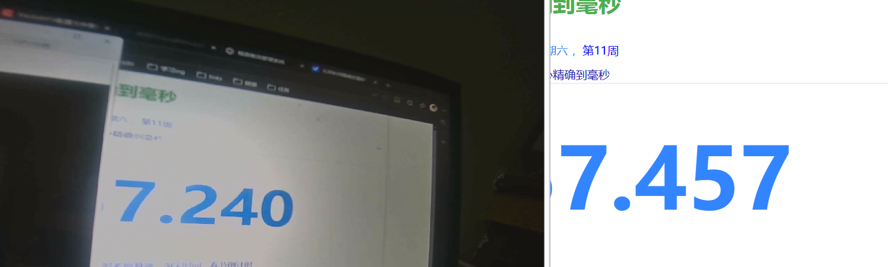
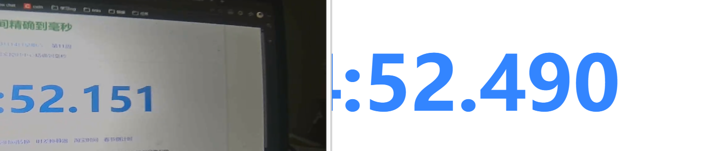

# VideoPush - 智能视频推流系统

## 一、项目介绍

一款基于 NVIDIA GPU 加速的智能视频推流系统，支持实时视频采集、YOLOv11 人物检测、RTSP 推流和自动录像功能。适用于智能安防、视频监控、直播推流等场景。

### 主要特性

- **硬件加速采集**：支持 MJPG 格式采集 + CUDA 硬件解码（mjpeg_cuvid）
- **实时目标检测**：基于 ONNX Runtime + YOLOv11 的 GPU 加速推理
- **高效推流**：NVENC 硬件编码 + RTSP 实时推流
- **智能录像**：检测到人物自动录制，离开后自动停止
- **模块化设计**：各功能模块独立，易于扩展和维护

---

## 二、系统架构

```
┌─────────────────────────────────────────────────────────────────┐
│                         VideoPush 系统                           │
├─────────────────────────────────────────────────────────────────┤
│                                                                  │
│  ┌──────────────┐    ┌──────────────┐    ┌──────────────┐       │
│  │ VideoSource  │───▶│   Detector   │───▶│  FFmpegPush  │       │
│  │   (采集模块)  │    │  (检测模块)   │    │   (推流模块)  │       │
│  │              │    │              │    │              │       │
│  │ • dshow采集   │    │ • YOLOv11    │    │ • NVENC编码  │       │
│  │ • MJPG格式   │    │ • ONNX推理    │    │ • RTSP推流   │       │
│  │ • CUDA解码   │    │ • GPU加速     │    │ • 90kHz PTS  │       │
│  └──────────────┘    └──────────────┘    └──────────────┘       │
│         │                   │                   │                │
│         └───────────────────┴───────────────────┘                │
│                             │                                    │
│                    ┌────────▼────────┐                          │
│                    │  VideoRecorder  │                          │
│                    │    (录制模块)    │                          │
│                    │                 │                          │
│                    │ • 人物触发录制   │                          │
│                    │ • 自动停止      │                          │
│                    │ • MP4封装       │                          │
│                    └─────────────────┘                          │
│                                                                  │
└─────────────────────────────────────────────────────────────────┘
```

---

## 三、项目结构

```
Graduation project/
├── main.cpp                 # 程序入口
├── config.json              # 配置文件
├── CMakeLists.txt           # CMake 构建配置
│
├── src/
│   ├── video_source/        # 视频采集模块
│   │   ├── VideoSource.h
│   │   └── VideoSource.cpp
│   │
│   ├── core_onnx/           # 目标检测模块
│   │   ├── yolov11_onnx.h
│   │   └── yolov11_onnx.cpp
│   │
│   ├── core_push/           # RTSP 推流模块
│   │   ├── video_push.h
│   │   └── video_push.cpp
│   │
│   ├── core_recorder/       # 视频录制模块
│   │   ├── VideoRecorder.h
│   │   └── VideoRecorder.cpp
│   │
│   ├── core_zpusher/        # 主控制器
│   │   ├── Zpusher.h
│   │   └── Zpusher.cpp
│   │
│   ├── core_thread/         # 线程池
│   │   ├── threadPool.h
│   │   └── threadPool.cpp
│   │
│   ├── core_config/         # 配置解析
│   │   ├── config.h
│   │   └── Config.cpp
│   │
│   └── safe_queue/          # 线程安全队列
│       ├── VideoFrameQueue.h
│       ├── FrameData.h
│       └── VideoFrame.h
│
├── 3rdparty/                # 第三方库
│   ├── ffmpeg_7.1_cuda/     # FFmpeg CUDA 版本
│   ├── opencv/              # OpenCV 4.12.0
│   └── onnxruntime/         # ONNX Runtime GPU
│
└── model/                   # 模型文件
    └── yolo11n.onnx
```

---

## 四、环境要求

### 硬件要求

| 组件 | 要求 |
|------|------|
| GPU | NVIDIA GTX 1650 或更高（支持 NVENC） |
| CPU | 支持 AVX2 指令集 |
| 内存 | 8GB 或以上 |
| 存储 | 500MB 可用空间 |

### 软件要求

| 软件 | 版本 |
|------|------|
| Windows | 10/11 64-bit |
| CUDA Toolkit | 12.x |
| cuDNN | 8.9.7 |
| CMake | 3.10+ |
| Visual Studio | 2022 (MSVC v143) |

### 第三方库

| 库 | 版本 | 说明 |
|---|------|------|
| FFmpeg | 7.1 (CUDA) | 需包含 nvenc、cuvid 支持 |
| OpenCV | 4.12.0 | 预编译版本 |
| ONNX Runtime | 1.17.3 | GPU 版本 |
| nv-codec-headers | 12.1.14.0 | NVIDIA 编码头文件 |

---

## 五、编译与运行

### 1. 克隆项目

```bash
git clone <repository-url>
cd "Graduation project"
```

### 2. 准备依赖库

将以下库放入 `3rdparty/` 目录：

```
3rdparty/
├── ffmpeg_7.1_cuda/
│   ├── include/
│   ├── lib/
│   └── bin/
├── opencv/
│   ├── include/
│   └── lib/
└── onnxruntime/
    ├── include/
    └── lib/
```

### 3. 编译项目

```bash
mkdir build && cd build
cmake ..
cmake --build . --config Release
```

### 4. 配置文件

编辑 `config.json`：

```json
{
    "push": {
        "rtsp_url": "rtsp://192.168.5.66:554/live/test",
        "video_width": 1920,
        "video_height": 1080,
        "frame_rate": 24,
        "video_bitrate": 5000000
    },
    "capture": {
        "device_name": "video=HP Wide Vision HD Camera",
        "input_format": "dshow",
        "video_width": 640,
        "video_height": 360,
        "framerate": 24
    },
    "detector": {
        "enabled": true,
        "model_path": "model/yolo11n.onnx",
        "confidence_threshold": 0.5,
        "input_width": 640,
        "input_height": 640
    },
    "recorder": {
        "enabled": true,
        "output_dir": "recordings",
        "person_leave_timeout_ms": 3000
    }
}
```

### 5. 运行程序

```bash
./bin/Release/VideoPush.exe
```

---

## 六、模块说明

### 6.1 视频采集模块 (VideoSource)

- **采集方式**：DirectShow (dshow)
- **视频格式**：MJPEG
- **硬件解码**：mjpeg_cuvid (CUDA)
- **输出格式**：NV12 → BGR24 (OpenCV Mat)

### 6.2 目标检测模块 (YOLOv11)

- **推理引擎**：ONNX Runtime GPU
- **模型**：YOLOv11n
- **检测类别**：person（可扩展）
- **置信度阈值**：可配置

### 6.3 推流模块 (FFmpegPush)

- **编码器**：h264_nvenc
- **编码预设**：p4 (低延迟)
- **码率控制**：CBR
- **时间基**：MPEG 90kHz 标准
- **协议**：RTSP over TCP

### 6.4 录制模块 (VideoRecorder)

- **触发条件**：检测到人物
- **停止条件**：人物离开超时（默认 3 秒）
- **输出格式**：MP4 (H.264)
- **时间基**：MPEG 90kHz 标准

---

## 七、PTS 时间戳设计

系统采用 MPEG 标准 90kHz 时间基：

| 参数 | 值 |
|------|-----|
| time_base | `{1, 90000}` |
| 1ms | 90 ticks |
| 1帧 (24fps) | 3750 ticks |
| 1帧 (30fps) | 3000 ticks |

**PTS 计算方式：**
- 推流：`pts = frame_index × (90000 / fps)`
- 录制：`pts = elapsed_ms × 90`

---

## 八、效果展示

### 推理效果对比

#### 无推理模式


#### 有推理模式


### 延迟对比

| 模式 | 端到端延迟 | 说明 |
|------|-----------|------|
| **无推理模式** | 200-400ms | 采集 → 编码 → 推流 |
| **有推理模式** | 400-800ms | 采集 → 检测 → 编码 → 推流 |

**延迟组成分析：**

| 处理环节 | 无推理 | 有推理 |
|----------|--------|--------|
| 视频采集 | 10-20ms | 10-20ms |
| CUDA 解码 | 5-10ms | 5-10ms |
| YOLOv11 推理 | - | 150-300ms |
| 图像缩放 | 5-10ms | 5-10ms |
| NVENC 编码 | 10-20ms | 10-20ms |
| 网络传输 | 50-100ms | 50-100ms |
| 流媒体服务器 | 100-200ms | 100-200ms |
| **总计** | **200-400ms** | **400-800ms** |

> 注：延迟受网络环境、服务器性能、客户端播放器等因素影响，以上数据为本地测试参考值。

---

## 九、性能优化

### GPU 加速链路

```
摄像头(MJPG) → CUDA解码 → GPU显存 → 检测推理 → NVENC编码 → RTSP推流
```

### 优化建议

1. **采集分辨率**：根据检测需求选择，建议 640x360 或 1280x720
2. **推流分辨率**：输出分辨率可高于采集分辨率
3. **帧率设置**：实时监控建议 15-30fps
4. **码率设置**：1080p 建议 3-5Mbps

### 已优化的延迟问题

| 问题 | 解决方案 |
|------|----------|
| 长时间运行延迟累积 | 使用实际时间戳计算 PTS |
| 帧队列缓冲过大 | 队列大小改为 1 |
| 编码器缓冲延迟 | NVENC 使用 p1 + ull 预设 |
| 流媒体服务器缓冲 | writeQueueSize 调整为 16 |

---

## 十、常见问题

### Q1: 找不到摄像头设备

检查设备名称：
```bash
ffmpeg -list_devices true -f dshow -i dummy
```

### Q2: NVENC 编码器不可用

确认 GPU 支持 NVENC：
```bash
ffmpeg -encoders | findstr nvenc
```

### Q3: CUDA 解码器不可用

确认 FFmpeg 包含 cuvid 支持：
```bash
ffmpeg -decoders | findstr cuvid
```

### Q4: 录制视频播放速度异常

已修复：使用实际时间戳计算 PTS，确保录制时长准确。

---

## 十一、版本更新

| 版本 | 更新内容 |
|------|----------|
| 0.1 | 基础采集模块，dshow + FFmpeg |
| 0.2 | CUDA 硬件解码支持 |
| 0.3 | YOLOv11 目标检测集成 |
| 0.4 | NVENC 硬件编码推流 |
| 0.5 | 智能录像功能 |
| 0.6 | MPEG 90kHz 时间基标准化 |
| 0.7 | 录制 PTS 时间戳修复 |
| 0.8 | Flask Web 管理界面 |
| 0.9 | 延迟优化（PTS 实时同步、队列优化）|
