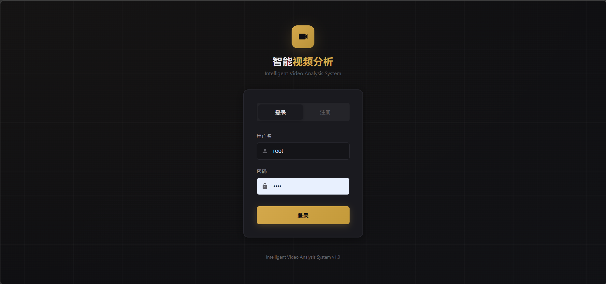
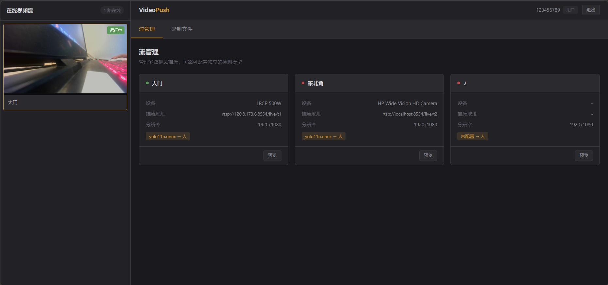
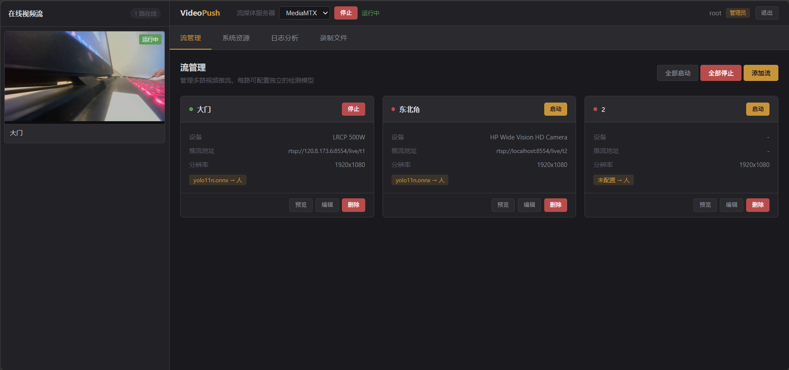
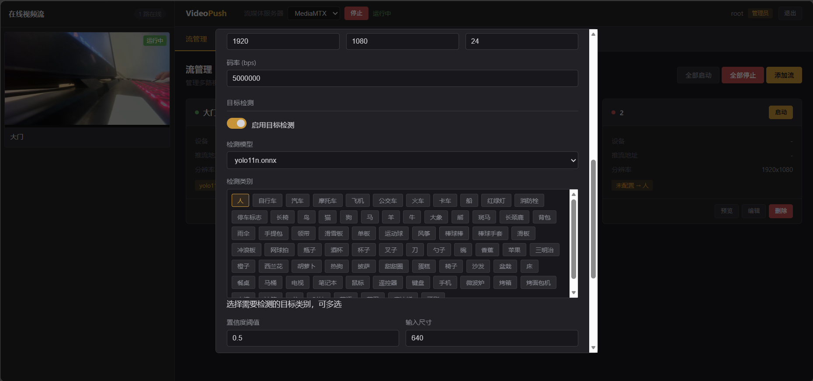
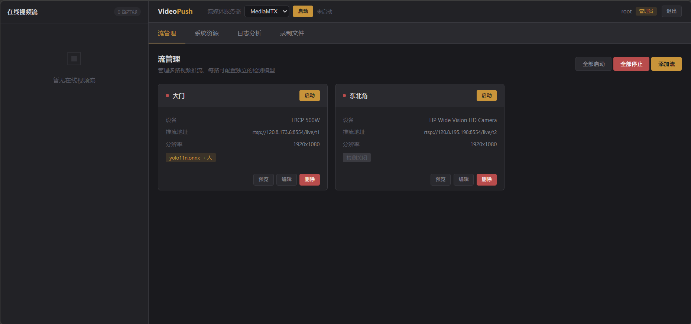
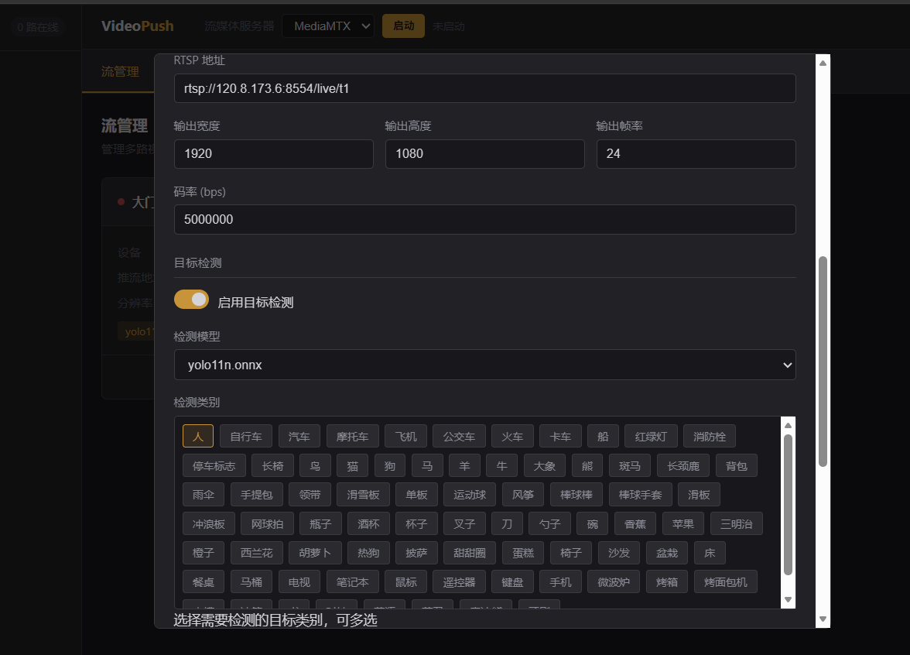
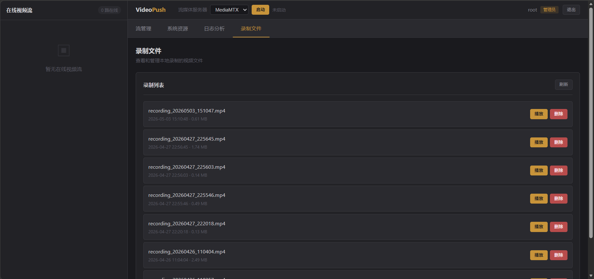

# VideoPush - 智能视频分析系统

## 一、项目介绍

一款基于 NVIDIA GPU 加速的智能视频分析系统，支持多路视频采集、YOLOv11 目标检测、RTSP 推流、HLS 预览和自动录像功能。配备 Web 管理界面，支持多用户权限管理。适用于智能安防、视频监控、直播推流等场景。

### 主要特性

- **多路流管理**：支持同时推多路视频流，每路流独立配置
- **硬件加速采集**：支持 MJPG 格式采集 + CUDA 硬件解码（mjpeg_cuvid）
- **实时目标检测**：基于 ONNX Runtime + YOLOv11 的 GPU 加速推理，支持 80 种 COCO 类别
- **高效推流**：NVENC 硬件编码 + RTSP 实时推流
- **智能录像**：检测到目标自动录制，离开后自动停止
- **Web 管理界面**：Flask 后端 + 现代化前端，支持用户权限管理
- **HLS 低延迟预览**：优化配置后延迟可降至 2-4 秒

---

## 二、系统架构

```
┌─────────────────────────────────────────────────────────────────────────┐
│                        VideoPush 智能视频分析系统                          │
├─────────────────────────────────────────────────────────────────────────┤
│                                                                          │
│  ┌──────────────┐    ┌──────────────┐    ┌──────────────┐               │
│  │ VideoSource  │───▶│   Detector   │───▶│  FFmpegPush  │               │
│  │   (采集模块)  │    │  (检测模块)   │    │   (推流模块)  │               │
│  │              │    │              │    │              │               │
│  │ • dshow采集   │    │ • YOLOv11    │    │ • NVENC编码  │               │
│  │ • MJPG格式   │    │ • ONNX推理    │    │ • RTSP推流   │               │
│  │ • CUDA解码   │    │ • 80类检测    │    │ • 90kHz PTS  │               │
│  └──────────────┘    └──────────────┘    └──────────────┘               │
│         │                   │                   │                        │
│         └───────────────────┴───────────────────┘                        │
│                             │                                            │
│                    ┌────────▼────────┐                                  │
│                    │  VideoRecorder  │                                  │
│                    │    (录制模块)    │                                  │
│                    │                 │                                  │
│                    │ • 目标触发录制   │                                  │
│                    │ • 自动停止      │                                  │
│                    │ • MP4封装       │                                  │
│                    └─────────────────┘                                  │
│                                                                          │
├─────────────────────────────────────────────────────────────────────────┤
│                           Web 管理系统                                    │
│  ┌──────────────┐    ┌──────────────┐    ┌──────────────┐               │
│  │ Flask 后端   │    │  流管理 API   │    │  用户权限    │               │
│  │              │    │              │    │              │               │
│  │ • REST API   │    │ • 多路流配置  │    │ • 管理员     │               │
│  │ • 进程管理   │    │ • 启停控制    │    │ • 普通用户   │               │
│  └──────────────┘    └──────────────┘    └──────────────┘               │
│                                                                          │
│  ┌──────────────┐    ┌──────────────┐    ┌──────────────┐               │
│  │ 前端界面     │    │  HLS 预览    │    │ MediaMTX     │               │
│  │              │    │              │    │              │               │
│  │ • 流管理     │    │ • 低延迟配置  │    │ • RTSP服务   │               │
│  │ • 系统监控   │    │ • 实时播放   │    │ • HLS转码    │               │
│  └──────────────┘    └──────────────┘    └──────────────┘               │
│                                                                          │
└─────────────────────────────────────────────────────────────────────────┘
```

---

## 三、项目结构

```
Graduation project/
├── main.cpp                     # 程序入口（支持 --config 参数）
├── config.json                  # 默认配置文件
├── CMakeLists.txt               # CMake 构建配置
│
├── src/
│   ├── video_source/            # 视频采集模块
│   │   ├── VideoSource.h
│   │   └── VideoSource.cpp
│   │
│   ├── core_onnx/               # 目标检测模块
│   │   ├── yolov11_onnx.h
│   │   └── yolov11_onnx.cpp
│   │
│   ├── core_push/               # RTSP 推流模块
│   │   ├── video_push.h
│   │   └── video_push.cpp
│   │
│   ├── core_recorder/           # 视频录制模块
│   │   ├── VideoRecorder.h
│   │   └── VideoRecorder.cpp
│   │
│   ├── core_zpusher/            # 主控制器
│   │   ├── Zpusher.h
│   │   └── Zpusher.cpp
│   │
│   ├── core_thread/             # 线程池
│   │   ├── threadPool.h
│   │   └── threadPool.cpp
│   │
│   ├── core_config/             # 配置解析
│   │   ├── config.h
│   │   └── Config.cpp
│   │
│   └── safe_queue/              # 线程安全队列
│       ├── VideoFrameQueue.h
│       ├── FrameData.h
│       └── VideoFrame.h
│
├── web_manager/                 # Web 管理系统
│   ├── app.py                   # Flask 后端
│   ├── templates/
│   │   ├── index.html           # 主界面
│   │   └── login.html           # 登录界面
│   └── requirements.txt         # Python 依赖
│
├── mediamtx/                    # MediaMTX 流媒体服务器
│   ├── mediamtx.exe
│   └── medamtx.yml
│
├── streams/                     # 流配置目录
│   ├── stream_xxx.json          # 流配置文件
│   └── stream_xxx.log           # 流运行日志
│
├── recordings/                  # 录制文件目录
│
├── users.json                   # 用户数据
│
├── 3rdparty/                    # 第三方库
│   ├── ffmpeg_7.1_cuda/         # FFmpeg CUDA 版本
│   ├── opencv/                  # OpenCV 4.12.0
│   └── onnxruntime/             # ONNX Runtime GPU
│
└── model/                       # 模型文件
    └── yolo11n.onnx
```

---

## 四、环境要求

### 硬件要求

| 组件 | 要求 |
|------|------|
| GPU | NVIDIA GTX 1650 或更高（支持 NVENC） |
| CPU | 支持 AVX2 指令集 |
| 内存 | 8GB 或以上 |
| 存储 | 500MB 可用空间 |

### 软件要求

| 软件 | 版本 |
|------|------|
| Windows | 10/11 64-bit |
| CUDA Toolkit | 12.x |
| cuDNN | 8.9.7 |
| CMake | 3.10+ |
| Visual Studio | 2022 (MSVC v143) |
| Python | 3.8+ |

### 第三方库

| 库 | 版本 | 说明 |
|---|------|------|
| FFmpeg | 7.1 (CUDA) | 需包含 nvenc、cuvid 支持 |
| OpenCV | 4.12.0 | 预编译版本 |
| ONNX Runtime | 1.17.3 | GPU 版本 |
| nv-codec-headers | 12.1.14.0 | NVIDIA 编码头文件 |

### Python 依赖

```
flask>=2.0.0
psutil>=5.8.0
```

---

## 五、快速开始

### 1. 克隆项目

```bash
git clone <repository-url>
cd "Graduation project"
```

### 2. 准备依赖库

将以下库放入 `3rdparty/` 目录：

```
3rdparty/
├── ffmpeg_7.1_cuda/
│   ├── include/
│   ├── lib/
│   └── bin/
├── opencv/
│   ├── include/
│   └── lib/
└── onnxruntime/
    ├── include/
    └── lib/
```

### 3. 编译 C++ 项目

```bash
mkdir build && cd build
cmake ..
cmake --build . --config Release
```

### 4. 安装 Python 依赖

```bash
pip install -r web_manager/requirements.txt
```

### 5. 启动 Web 管理系统

```bash
cd web_manager
python app.py
```

### 6. 访问管理界面

打开浏览器访问 `http://localhost:5000`

**默认管理员账号：**
- 用户名：`root`
- 密码：`root`

---

## 六、Web 管理界面

### 功能概览

| 功能 | 管理员 | 普通用户 |
|------|--------|----------|
| 查看流列表 | ✅ | ✅ |
| 预览在线视频流 | ✅ | ✅ |
| 查看录制文件 | ✅ | ✅ |
| 播放录制文件 | ✅ | ✅ |
| 添加/编辑/删除流 | ✅ | ❌ |
| 启动/停止推流 | ✅ | ❌ |
| 查看日志分析 | ✅ | ❌ |
| 查看系统资源 | ✅ | ❌ |
| 删除录制文件 | ✅ | ❌ |
| 启动/停止流媒体服务器 | ✅ | ❌ |

### 界面展示

#### 登录界面



#### 用户界面



#### 管理员界面



### 界面说明

#### 左侧面板 - 在线视频流预览
- 自动显示所有运行中的视频流
- 点击流卡片可加载 HLS 预览
- 实时显示在线流数量

#### 流管理页面
- 卡片式展示所有流配置
- 显示流状态、设备、推流地址、检测模型
- 支持启动/停止/编辑/删除操作

#### 系统资源页面（管理员）
- CPU、内存、磁盘、GPU 使用率监控
- 推流进程资源占用统计

#### 日志分析页面（管理员）
- 按流选择查看运行日志
- 支持错误/警告/信息高亮显示

#### 录制文件页面
- 查看所有录制的视频文件
- 支持播放和删除操作

---

## 七、多路流配置

### 流配置文件结构

每个流配置存储在 `streams/` 目录下的 JSON 文件中：

```json
{
    "name": "大门摄像头",
    "enabled": true,
    "capture": {
        "device_name": "video=LRCP 500W",
        "input_format": "dshow",
        "video_width": 1920,
        "video_height": 1080,
        "framerate": 30
    },
    "push": {
        "rtsp_url": "rtsp://192.168.1.100:8554/live/stream1",
        "video_width": 1920,
        "video_height": 1080,
        "frame_rate": 24,
        "video_bitrate": 5000000
    },
    "detector": {
        "enabled": true,
        "model_path": "model/yolo11n.onnx",
        "confidence_threshold": 0.5,
        "input_width": 640,
        "input_height": 640,
        "classes": ["person", "car"]
    },
    "recorder": {
        "enabled": true,
        "output_dir": "recordings",
        "person_leave_timeout_ms": 3000
    }
}
```

### 检测类别配置

系统支持 80 种 COCO 类别检测，常用类别：

| 类别 | 英文名称 |
|------|----------|
| 人 | person |
| 汽车 | car |
| 摩托车 | motorcycle |
| 公交车 | bus |
| 卡车 | truck |
| 自行车 | bicycle |
| 狗 | dog |
| 猫 | cat |

在 Web 界面添加/编辑流时，可在"检测类别"区域多选需要检测的目标。

---

## 八、模块说明

### 8.1 视频采集模块 (VideoSource)

- **采集方式**：DirectShow (dshow)
- **视频格式**：MJPEG
- **硬件解码**：mjpeg_cuvid (CUDA)
- **输出格式**：NV12 → BGR24 (OpenCV Mat)

### 8.2 目标检测模块 (YOLOv11)

- **推理引擎**：ONNX Runtime GPU
- **模型**：YOLOv11n
- **检测类别**：80 种 COCO 类别（可配置）
- **置信度阈值**：可配置

### 8.3 推流模块 (FFmpegPush)

- **编码器**：h264_nvenc
- **编码预设**：p1 + ull (超低延迟)
- **码率控制**：CBR
- **时间基**：MPEG 90kHz 标准
- **协议**：RTSP over TCP
- **重试机制**：连接失败自动重试 3 次

### 8.4 录制模块 (VideoRecorder)

- **触发条件**：检测到目标
- **停止条件**：目标离开超时（可配置）
- **输出格式**：MP4 (H.264)
- **编码器**：NVENC 硬件编码

---

## 九、HLS 低延迟预览

### MediaMTX 配置

`mediamtx/mediamtx.yml` 关键配置：

```yaml
hlsAddress: :8888
hlsAllowOrigin: '*'
hlsAlwaysRemux: true
hlsVariant: lowLatency
hlsSegmentCount: 4
hlsSegmentDuration: 200ms
hlsPartDuration: 50ms
```

### 前端 HLS.js 配置

```javascript
{
    enableWorker: true,
    lowLatencyMode: true,
    backBufferLength: 0,
    maxBufferLength: 1,
    maxMaxBufferLength: 2,
    liveSyncDuration: 0.3,
    liveMaxLatencyDuration: 2
}
```

### 延迟效果

| 配置 | 延迟 |
|------|------|
| 默认 HLS | 10-15 秒 |
| 优化后 HLS | **2-4 秒** |

---

## 十、PTS 时间戳设计

系统采用 MPEG 标准 90kHz 时间基：

| 参数 | 值 |
|------|-----|
| time_base | `{1, 90000}` |
| 1ms | 90 ticks |
| 1帧 (24fps) | 3750 ticks |
| 1帧 (30fps) | 3000 ticks |

**PTS 计算方式：**
- 推流：`pts = frame_index × (90000 / fps)`
- 录制：`pts = elapsed_ms × 90`

---

## 十一、效果展示

### 推理效果

检测到目标时会在画面上绘制边界框和标签，并在左上角显示警告提示。

#### 有推理模式


#### 无推理模式


### 推流模型选择



### 延迟对比

| 模式 | 端到端延迟 | 说明 |
|------|-----------|------|
| **无推理模式** | 200-400ms | 采集 → 编码 → 推流 |
| **有推理模式** | 400-800ms | 采集 → 检测 → 编码 → 推流 |

### 系统运行截图







**延迟组成分析：**

| 处理环节 | 无推理 | 有推理 |
|----------|--------|--------|
| 视频采集 | 10-20ms | 10-20ms |
| CUDA 解码 | 5-10ms | 5-10ms |
| YOLOv11 推理 | - | 150-300ms |
| 图像缩放 | 5-10ms | 5-10ms |
| NVENC 编码 | 10-20ms | 10-20ms |
| 网络传输 | 50-100ms | 50-100ms |
| 流媒体服务器 | 100-200ms | 100-200ms |
| **总计** | **200-400ms** | **400-800ms** |

---

## 十二、性能优化

### GPU 加速链路

```
摄像头(MJPG) → CUDA解码 → GPU显存 → 检测推理 → NVENC编码 → RTSP推流
```

### 优化建议

1. **采集分辨率**：根据检测需求选择，建议 640x360 或 1280x720
2. **推流分辨率**：输出分辨率可高于采集分辨率
3. **帧率设置**：实时监控建议 15-30fps
4. **码率设置**：1080p 建议 3-5Mbps
5. **多路流启动**：建议间隔 3 秒启动，避免资源竞争

### 已优化的延迟问题

| 问题 | 解决方案 |
|------|----------|
| 长时间运行延迟累积 | 使用实际时间戳计算 PTS |
| 帧队列缓冲过大 | 队列大小改为 1 |
| 编码器缓冲延迟 | NVENC 使用 p1 + ull 预设 |
| 流媒体服务器缓冲 | writeQueueSize 调整为 16 |
| HLS 预览延迟 | lowLatency 模式 + 分片优化 |

---

## 十三、API 接口

### 认证接口

| 接口 | 方法 | 说明 |
|------|------|------|
| `/api/login` | POST | 用户登录 |
| `/api/register` | POST | 用户注册 |
| `/api/logout` | POST | 用户登出 |
| `/api/check_auth` | GET | 检查登录状态 |

### 流管理接口

| 接口 | 方法 | 权限 | 说明 |
|------|------|------|------|
| `/api/streams` | GET | 用户 | 获取流列表 |
| `/api/streams` | POST | 管理员 | 创建流 |
| `/api/streams/<id>` | GET | 用户 | 获取流详情 |
| `/api/streams/<id>` | PUT | 管理员 | 更新流配置 |
| `/api/streams/<id>` | DELETE | 管理员 | 删除流 |
| `/api/streams/<id>/start` | POST | 管理员 | 启动流 |
| `/api/streams/<id>/stop` | POST | 管理员 | 停止流 |
| `/api/streams/<id>/log` | GET | 管理员 | 获取流日志 |
| `/api/streams/start_all` | POST | 管理员 | 启动所有流 |
| `/api/streams/stop_all` | POST | 管理员 | 停止所有流 |

### 其他接口

| 接口 | 方法 | 权限 | 说明 |
|------|------|------|------|
| `/api/devices` | GET | 用户 | 获取视频设备列表 |
| `/api/models` | GET | 用户 | 获取可用模型列表 |
| `/api/coco_classes` | GET | 用户 | 获取 COCO 类别列表 |
| `/api/system` | GET | 管理员 | 获取系统资源信息 |
| `/api/server/status` | GET | 用户 | 获取服务器状态 |
| `/api/server/start` | POST | 管理员 | 启动流媒体服务器 |
| `/api/server/stop` | POST | 管理员 | 停止流媒体服务器 |
| `/api/recordings` | GET | 用户 | 获取录制文件列表 |
| `/api/recording/play` | POST | 用户 | 播放录制文件 |
| `/api/recording/delete` | POST | 管理员 | 删除录制文件 |

---

## 十四、常见问题

### Q1: 找不到摄像头设备

检查设备名称：
```bash
ffmpeg -list_devices true -f dshow -i dummy
```

### Q2: NVENC 编码器不可用

确认 GPU 支持 NVENC：
```bash
ffmpeg -encoders | findstr nvenc
```

### Q3: CUDA 解码器不可用

确认 FFmpeg 包含 cuvid 支持：
```bash
ffmpeg -decoders | findstr cuvid
```

### Q4: 推流后预览不显示

1. 确认 MediaMTX 服务器已启动
2. 检查 HLS URL 是否正确
3. 查看浏览器控制台是否有错误

### Q5: 两路流同时推流失败

建议间隔 3 秒启动，避免 NVENC 编码 session 冲突。

### Q6: Flask 重启后流状态丢失

系统会自动检测日志文件判断流状态，确保 `streams/*.log` 文件存在。

---

## 十五、版本更新

| 版本 | 更新内容 |
|------|----------|
| 0.1 | 基础采集模块，dshow + FFmpeg |
| 0.2 | CUDA 硬件解码支持 |
| 0.3 | YOLOv11 目标检测集成 |
| 0.4 | NVENC 硬件编码推流 |
| 0.5 | 智能录像功能 |
| 0.6 | MPEG 90kHz 时间基标准化 |
| 0.7 | 录制 PTS 时间戳修复 |
| 0.8 | Flask Web 管理界面 |
| 0.9 | 延迟优化（PTS 实时同步、队列优化）|
| 1.0 | 多路流管理、用户权限系统 |
| 1.1 | 可配置检测类别（80 种 COCO） |
| 1.2 | HLS 低延迟预览优化 |
| 1.3 | Web 界面重构、工业监控风格 |

---

## 十六、许可证

本项目仅供学习和研究使用。
