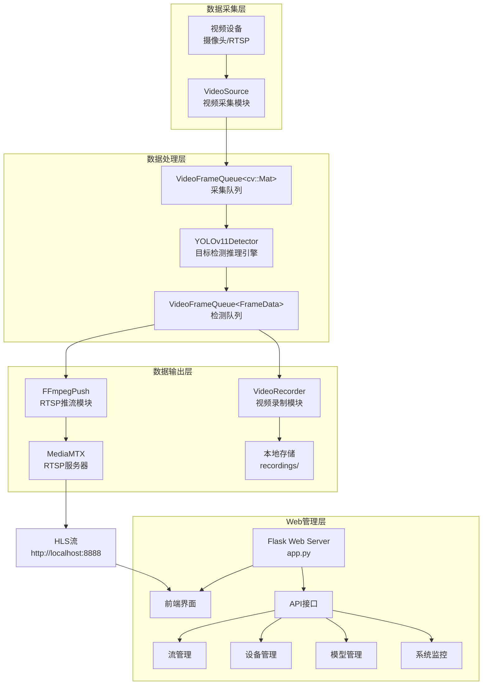
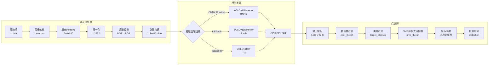
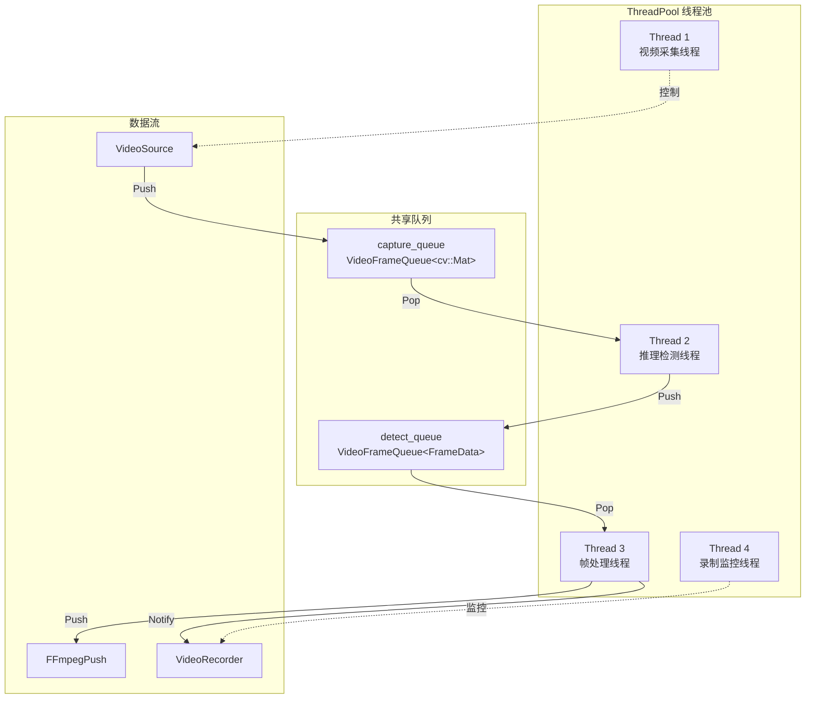
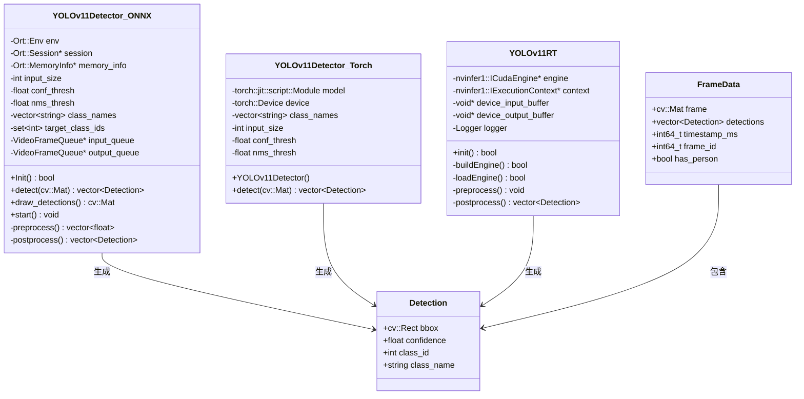
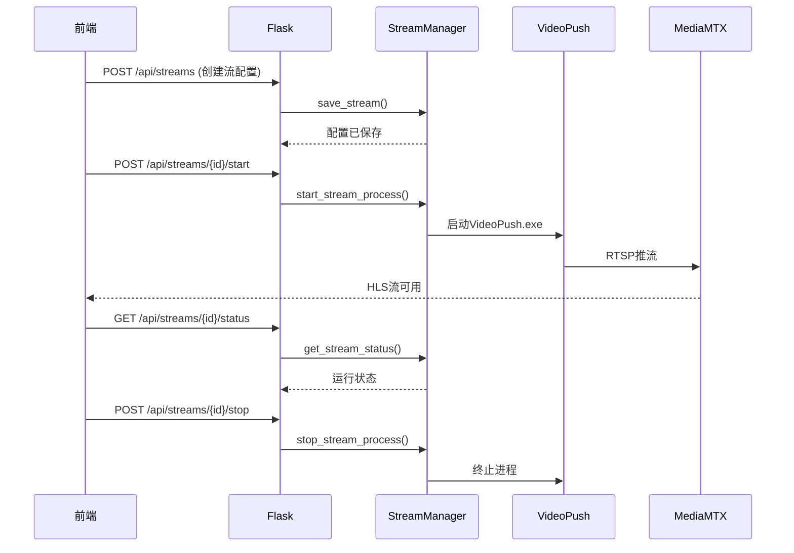
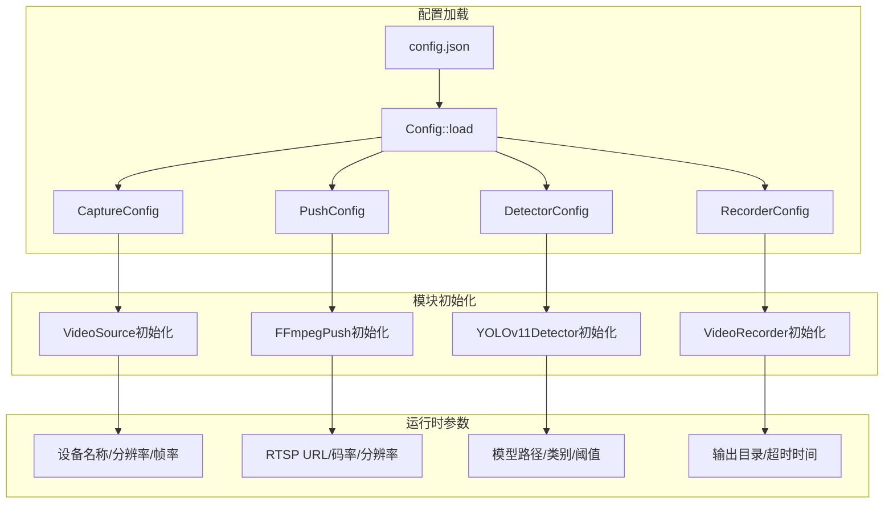
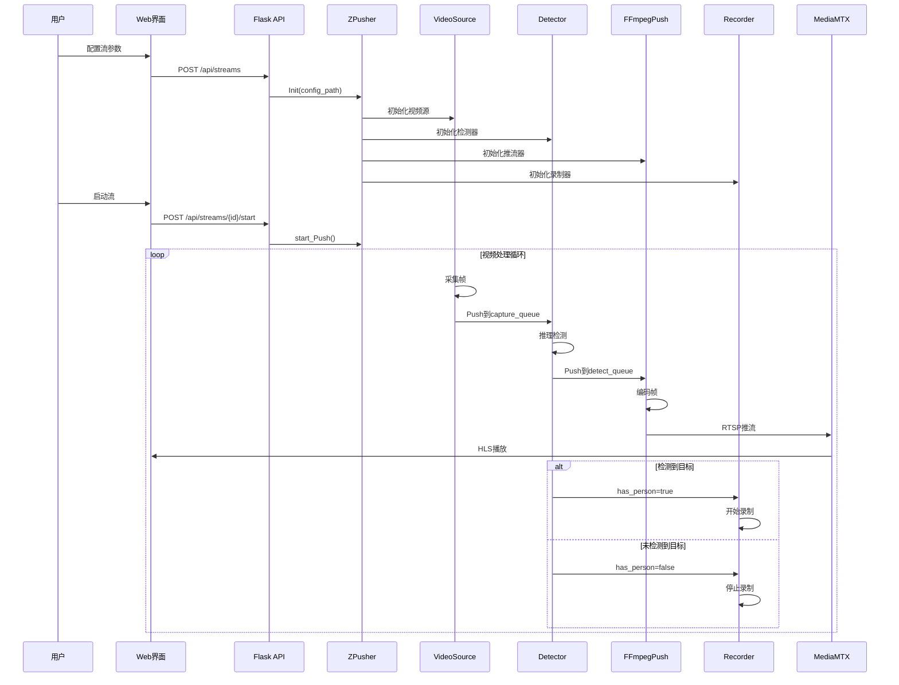

# 智能视频分析系统数据流分析图

## 1. 系统整体架构图



## 2. 核心推理模块数据流图



## 3. 多线程数据流图



## 4. 推理引擎类图



## 5. Web API数据流图



## 6. 配置数据流图



## 7. 完整系统时序图



## 8. 数据结构关系图

```mermaid
erDiagram
    FRAME_DATA {
        cv::Mat frame
        vector~Detection~ detections
        int64_t timestamp_ms
        int64_t frame_id
        bool has_person
    }
    
    DETECTION {
        cv::Rect bbox
        float confidence
        int class_id
        string class_name
    }
    
    CAPTURE_CONFIG {
        string device_name
        int video_width
        int video_height
        int framerate
    }
    
    PUSH_CONFIG {
        string rtsp_url
        int video_width
        int video_height
        int video_bitrate
        int frame_rate
    }
    
    DETECTOR_CONFIG {
        bool enabled
        string model_path
        vector~string~ classes
        float confidence_threshold
        int input_width
    }
    
    RECORDER_CONFIG {
        bool enabled
        string output_dir
        int person_leave_timeout_ms
    }
    
    FRAME_DATA ||--o{ DETECTION : contains
    CAPTURE_CONFIG ||--|| VideoSource : configures
    PUSH_CONFIG ||--|| FFmpegPush : configures
    DETECTOR_CONFIG ||--|| YOLOv11Detector : configures
    RECORDER_CONFIG ||--|| VideoRecorder : configures
```

## 说明

### 系统架构概述

该智能视频分析系统采用**生产者-消费者模式**，通过**多线程**和**共享队列**实现高效的视频处理流水线：

1. **视频采集线程**：使用FFmpeg从视频设备采集帧，支持硬件加速解码
2. **推理检测线程**：使用YOLOv11模型进行目标检测，支持ONNX/LibTorch/TensorRT三种后端
3. **帧处理线程**：将检测结果绘制到帧上，并推送到输出队列
4. **推流线程**：使用FFmpeg将处理后的帧编码并推送到RTSP服务器
5. **录制线程**：根据检测结果自动录制视频

### 数据流特点

- **异步处理**：各模块通过队列解耦，实现异步并行处理
- **帧丢弃策略**：队列满时自动丢弃旧帧，保证实时性
- **硬件加速**：支持CUDA加速的编解码和推理
- **灵活配置**：通过JSON配置文件灵活调整各模块参数
